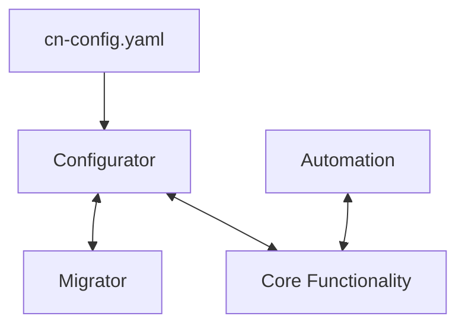
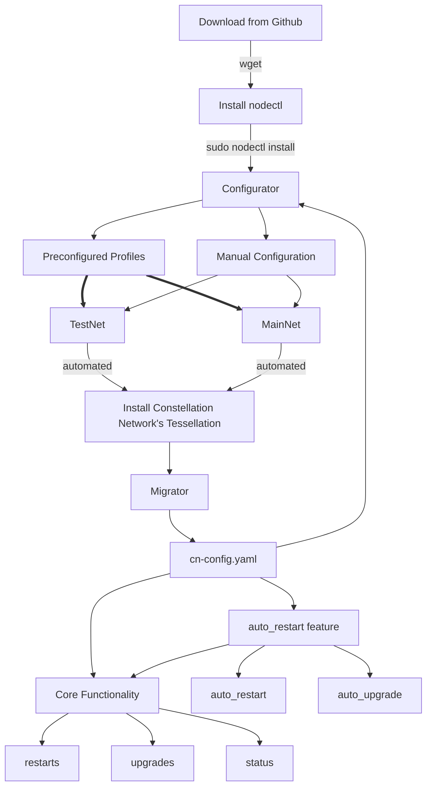

# Constellation Network
### nodectl `v2.0.0`

## Description

## TL;DR
nodectl is a command line utility designed to run on a Debian Linux operating system.  It is speciifcally designed to enhance and simplify the creation, day-to-day managment, and upgrade of a **Constellation Network Validator [ or genesis ] Node**.

Detailed instructions on usage and features can be found on [Constellation Network's Documentation hub](https://docs.constellationnetwork.io/)

## NODECTL CODE DETAILS

Constellation Network's **nodect** was created and designed by **Constellation Network** to **simplify** and pull out the complexity associated with running a **Constellation Network Validator Node**.  

For someone in the know, it is "easy to say" that a Node for any project is simple to deploy, just takes a little eblow grease and away you go!  

Unfortunately, the truth is; unless you have technical know how, no matter what simplistic tools are presented, there will be learning curves, trial and error, and some requirement to pay attention to detail.

With this in mind, **nodectl** was created to take a true **Systems and Site Reliability Engineering** out of the requirements to run a **Node**; morevoer, **nodectl** is designed to help you build your Node, run your Node, and administer your Node, with extensive documentation, help commands, and **community backing**. 

**nodectl** can be a powerful **utility** to help ease your journey to being a **Constellation Network Node Operator** and **Datapenuer**. 

## Usage

Extensive help has been written up and offered through [Constellation Network's Documenation hub](https://docs.constellationnetwork.io/).  

*In order to avoid making necessary updates in muliple locations, this open source project's documentataion pertaining to the operations of use of nodectl will be present on Constellation Network's Documentation Hub:*

Documentation consists of:
  - installation
  - upgrade
  - configuration
  - operation

## Internals
**nodectl** is written [currently] in Python3.  It is a combination of object oritentation and functional programming.  **nodectl** is integrated into three components main components.

#### Core Components
- core functionality
- configurator
  - migrator
  - cn-config.yaml
- automation (`auto_restart`)

## NODECTL workflow

## INSTALLATION

nodectl code can be downloaded to and run from a dedicated directory from the code off a dedicated directory, and then it can be run from `main.py`.

nodectl is designed to be compiled into a single binary executible and run as a single file with `+x` mode.  Code compiled into a a bianry called `nodectl`.

*please see 

