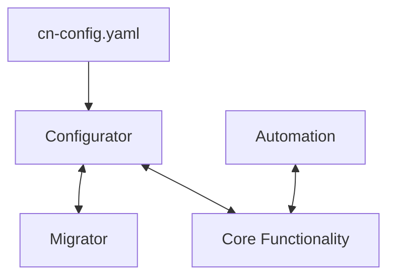
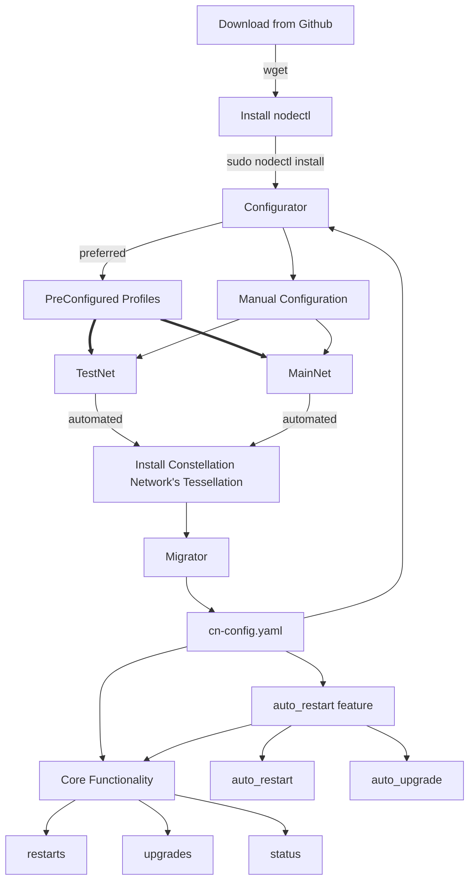

# Constellation Network
### nodectl `v2.0.0`

# Description

## TL;DR
nodectl is a command line utility designed to run on a Debian Linux operating system.  It is specifically designed to enhance and simplify the creation, day-to-day management, and upgrade of a **Constellation Network Validator [ or Genesis] Node**.

Detailed instructions on usage and features can be found on [Constellation Network's Documentation hub](https://docs.constellationnetwork.io/nodes)

## NODECTL CODE DETAILS

**nodectl** was designed to **simplify** and reduce the complexity associated with running a **Constellation Network Validator Node**.  

For someone in the know, it is "easy to say" that a Node for any project is simple to deploy, just takes a little elbow grease and away you go!  

Unfortunately, the truth is; unless you have technical know how, no matter what simplistic tools are presented, there will be learning curves, trial and error, and some requirement to pay attention to detail.

With this in mind, **nodectl** was created to take a true **Systems and Site Reliability Engineering** out of the requirements to run a **Node**; moreover, **nodectl** is designed to help you build your Node, run your Node, and administer your Node, with extensive documentation, help commands, and **community backing**. 

**nodectl** can be a powerful **utility** to help ease your journey to being a **Constellation Network Node Operator** and **Datapreneur **. 

## Usage

Extensive help has been written up and offered through [Constellation Network's Documentation hub](https://docs.constellationnetwork.io/valdiate).  

*In order to avoid making necessary updates in multiple locations, this open source project's documentation pertaining to the operations of use of nodectl will be present on Constellation Network's Documentation Hub:*

Documentation consists of:
  - installation
  - upgrade
  - configuration
  - operation

## Internals
**nodectl** is written in Python3. It is a combination of object oriented and functional programming.  **nodectl** is integrated into three components main components.

#### Core Components
- core functionality
- configurator
  - migrator
  - cn-config.yaml
- automation (`auto_restart`)

## NODECTL workflow

## OTHER DETAILS
*please see [Constellation Network's Documentation hub](https://docs.constellationnetwork.io/validate).*

